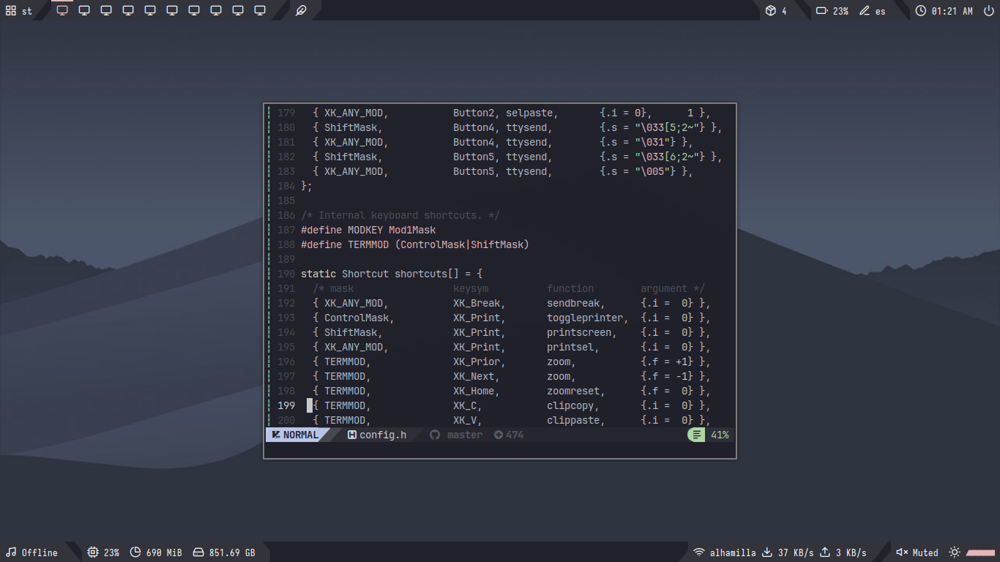

<!--                 Polybar themes installation section                     -->
<h2><a href="https://github.com/adi1090x/polybar-themes">Polybar-themes</a></h2>

**Dependencias:**
- **`Polybar`**
- **`Rofi`**
- **`pywal`**
- **``calc``**
- **``networkmanager_dmenu``**

```bash
sudo pacman -S polybar rofi python-pywal calc
yay -S networkmanager-dmenu-git
```

**Fuentes**

**``Text Fonts``**
- Iosevka Nerd Font
- Fantasque Sans Mono
- Noto Sans
- Droid Sans
- Terminus

**``Icon Fonts``**
- Iosevka Nerd Font
- Icomoon Feather
- Material Icons
- Waffle (Siji)

Instalar Iosevka Nerd Font mediante la <a href="https://www.nerdfonts.com/font-downloads">página oficial de Nerd Fonts</a>. Descomprimir .zip y mover fuentes en /usr/share/fonts. <br>
Instalar el resto de fuentes:

```bash
yay -S ttf-fantasque-sans-mono ttf-droid noto-fonts terminus-font ttf-icomoon-feather ttf-material-icons-git siji-git
````

Actualizar la cache de las fuentes:

```bash
fc-cache -fv
```

Instalar los temas (Ver repositorio oficial):

```bash
git clone --depth=1 https://github.com/adi1090x/polybar-themes.git
cd polybar-themes
chmod +x setup.sh
./setup.sh
```

Yo istalé el estilo 'Simple' y la barra con el tema cuts.

<!--                      GTK theme installation section                     -->
<h2><a href="#">GTK Configuration</a></h2>

- <a href="https://github.com/vinceliuice/Orchis-theme">GTK Theme (Orchis grey)</a>
- <a href="https://github.com/ful1e5/BreezeX_Cursor">Cursor (Breeze Light)</a>
